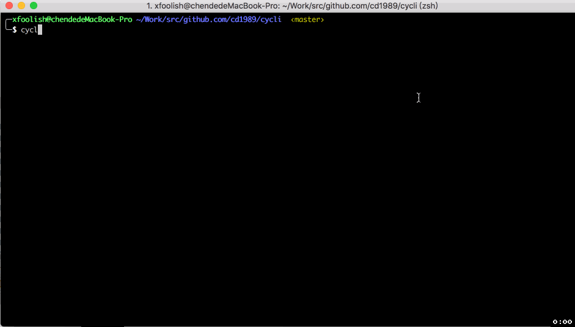

# cycli
CLI interface for Cyclone



## Build

```bash
$ make build
$ cp ./bin/cycli /usr/local/bin/
```

## Use

```bash
$ cycli use tenant devops
$ cycli get stg
$ cycli get wfr --status=f
$ cycli get wf --active
$ cycli get wf <name>
$ cycli get wfr <name>
```
